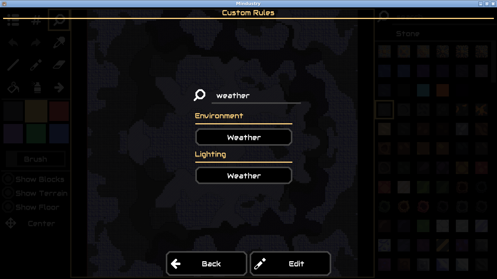
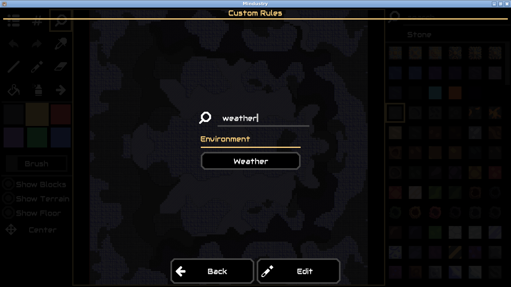

# MD-001: duplicate Weather controls

This is a selected historical Mindustry case, evaluated on September 14, 2026 (Japan time). It is one case with a Luna investigation and a Terra investigation plus refinement passes, not a representative benchmark.

The player [reported two Weather buttons in map rules](https://github.com/Anuken/Mindustry/issues/12647). The investigation received the short report and exact pre-fix revision `a5c178ae5abcc630613c233e0afbb361021d3828`. It did not receive the later human patch, changed-file list, GitHub comments or internet access.

## Recorded evidence

- [Before screenshot](before.png): the reduced baseline replay shows both Weather buttons.
- [After screenshot](after.png): the same replay reaches the rules view with one Weather button on the candidate build.
- [Replay](repro.yaml), [engineering report](report.md), [evaluator result](result.json) and [complete event audit](events.jsonl).
- [Source findings](source-findings.json): the investigator ranked `CustomRulesDialog.java` first and identified two explicit constructions of the same control.
- [Generated candidate](candidate.patch) and [rationale](patch-rationale.json): four lines removed from the duplicate construction in Lighting.
- [Candidate build log](candidate-build.txt): successful offline desktop build.
- [Candidate tests](candidate-tests.txt): 275 of 276 tests passed. `ModTestAllure.begin` failed while downloading a mod from GitHub in the network-disabled worker.
- [Untouched baseline network test](baseline-offline-mod-test.txt): the same `UnknownHostException` occurs without the candidate patch. It remains a failed candidate gate.
- [Container audit](isolation.json): no network, dropped capabilities, no secrets or Docker socket in the worker.
- [Preparation history audit](history-audit.json): the exact baseline snapshot reused by both investigations has no future objects or remotes. The later candidate worktree still cannot resolve the human fix commit.
- [Luna attempt](luna-attempt.json): not reproduced; retained alongside the successful Terra reproduction.
- [Initial Terra attempt](initial-terra-attempt.json): 5/5 baseline replays with 23 actions. Its candidate replay left the required target state, so expected-state verification rejected it and the run was stopped for replay refinement.

## Final observed result

| Check | Result |
| --- | --- |
| Original 23-action reproduction | 5/5 clean baseline runs |
| Reduced 8-action reproduction | 5/5 clean baseline runs |
| Candidate target-state replay | 5/5 reached the correct rules view with the duplicate absent |
| Source localization | First-ranked file matches the evaluator's later human-fix file |
| Candidate desktop build | Passed offline |
| Existing game tests | 275/276 passed; network-dependent mod test failed |
| Startup smoke | Passed; clean launch only |
| Overall candidate approval | **Blocked** because the existing-tests gate failed |

Terra first demonstrated the symptom after 174 seconds. Across the investigation and refinement jobs, it used 84 model calls, 1,057,809 input tokens and 11,504 output tokens, with about 44 minutes of cumulative job time. Preparation and development pauses are excluded from that duration. Luna's unsuccessful attempt is recorded separately. The action reduction is bounded, not a proof that eight actions is globally minimal.

The proposed patch was generated from the inspected pre-fix source. The evaluator's later human fix was used only to score file localization afterward. No human-authored game fix was supplied to the investigation. Generic runner changes and multiple refinement passes were made during this development session; they remain visible in the audit.

## Inspect or repeat

The local dashboard's `md-weather-terra-001` case contains the full runtime artifact store. Inspect its Source and Patch tabs, the eight recorded actions, and the five validation gates. The approval button stays disabled while the existing-tests gate is failed. Cloning this repository gives the selected evidence files above; it does not create fictional local investigation records.

To run another attempt, set `REPRO_MODEL=gpt-5.6-terra` in the local `.env`, import `benchmarks/manifests/MD-001.yaml` with `uv run repro import-case`, then prepare and investigate the returned case ID. Only the manifest's `input` fields are passed to the investigation.

## Evidence boundaries

The report's platform was Windows; this run used the Linux AMD64 desktop under Docker on Apple Silicon. Mindustry is the external game being tested, not an original REPRO game. Visual judgments use separate calls to the same model family; they are not calibrated ground truth. The source was a depth-one snapshot, so ownership history is intentionally unavailable. Preparation had temporary network access for dependencies; investigation and candidate validation did not. Startup smoke coverage is limited to a clean launch. No target-game repository was changed upstream.

The unsuccessful attempts, cancellations, refinement passes and test failures are part of the result. Do not present this development session as one uninterrupted autonomous resolution or use it to claim an accuracy percentage.
