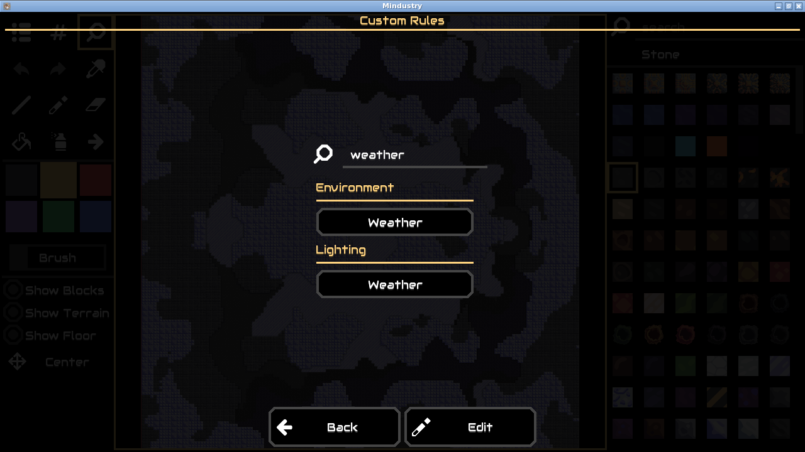
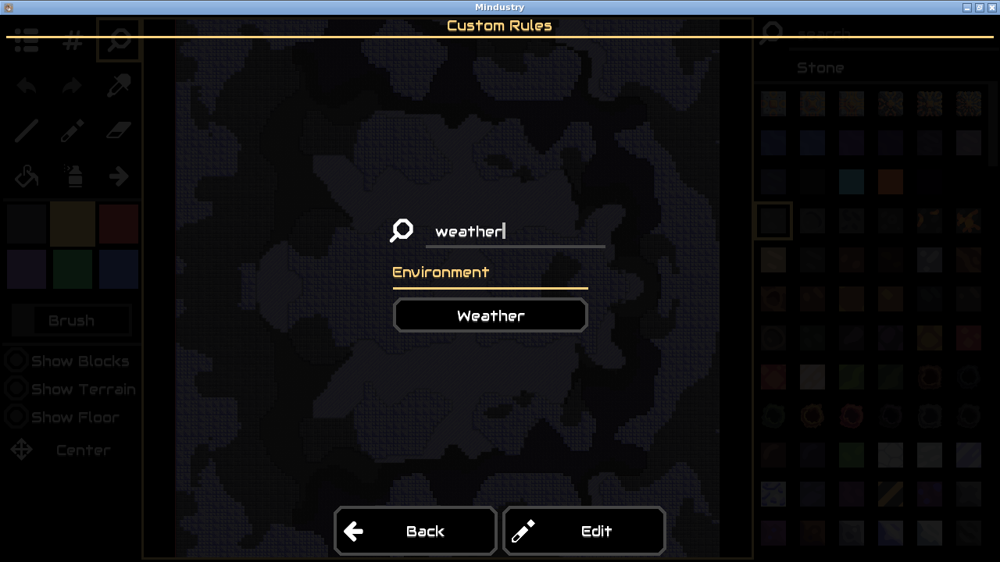

# MD-001: validation with network access for tests

On September 14, 2026, the existing candidate was revalidated after enabling network access for compilation and upstream tests. **All five gates passed.** The local case `md-weather-terra-001` is awaiting human review, and **Approve for handoff** is enabled. Approval records a local decision; it does not publish a patch to Mindustry.

| Gate | Observed result |
| --- | --- |
| Regression before patch | Duplicate Weather controls observed in 5/5 fresh baseline runs |
| Candidate build | Passed |
| Existing tests | 276 passed, zero failures/errors/skips |
| Original replay after patch | 5/5 reached the target rules view with one Weather control |
| Startup smoke | Passed; clean launch only |

The original failure was `ModTestAllure.begin`: it downloads a pinned mod fixture from GitHub even when Gradle uses `--offline`. With networking enabled, that test passed in 4.661 seconds. No test was skipped, rewritten or waived. The [original offline result](../README.md) and its failed test log remain intact.

The candidate patch is unchanged: SHA-256 `59859c8d443e1564f759f0b08ec36e17aa8aee4fa598b243671b42b6491b317b`. This rerun reused the original eight recorded actions and retained pre-fix build. The updated worker waits for Mindustry's load-complete marker before sending the first action; all recorded action waits remain unchanged. Both baseline and candidate runs start with fresh profiles in new offline containers. Build/test execution alone uses Docker bridge networking. The sampled container audit confirms dropped capabilities, a read-only root, process/resource limits, and no credential environment variables.

This rerun took **472 seconds** and used **15 Terra calls**, 34,347 input tokens and 2,381 output tokens. It includes five new baseline verifications, five candidate symptom verifications, five candidate expected-state verifications, compilation, the complete upstream suite, and startup smoke. These figures describe one selected development case, not general accuracy or end-to-end performance.

## Evidence

- [Result and gate details](result.json), [engineering report](report.md), [replay](repro.yaml), and [116-event rerun audit](events.jsonl).
- [Candidate build log](candidate-build.txt), [full test log](candidate-tests.txt), and [JUnit suite totals](test-summary.json).
- [Sampled container inspection](container-audit.json) and [original case snapshot before this rerun](validation-before-rerun.json).
- [Artifact identifiers and hashes](artifacts.json), [baseline screenshot](before.png), [candidate screenshot](after.png), and five separately recorded candidate replay screenshots (`candidate-replay-1.png` through `candidate-replay-5.png`).
- [Worker timing comparison](worker-timing/README.md): median 47.3 to 30.9 seconds for the eight-action desktop replay, excluding model calls.

The earlier investigation's source localization and candidate generation were not repeated or changed. The evaluator's later human patch was not supplied to either verifier. Visual judgments remain model-based, and smoke coverage remains limited to startup. No target-game changes were pushed upstream.
