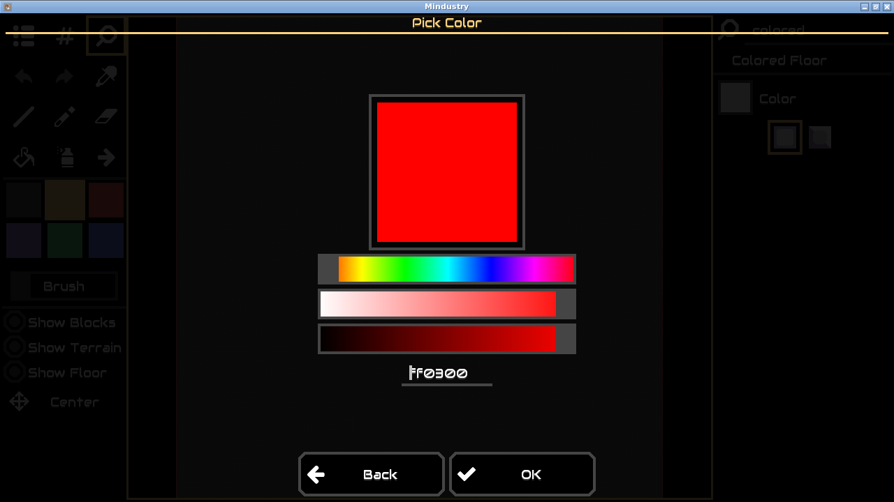

# Mindustry #12623: Linux qualification

Baseline: **5/5 clean reproductions**. Human-fixed control: **passed once**.

[Baseline results and actions](baseline.json) · [Human-fixed result](human-fixed.json) · [Environment and test counts](environment.json)

[Method, retained failures and limitations](../README.md)

Baseline: before/input

Baseline: after reopening

Human-fixed: after reopening

