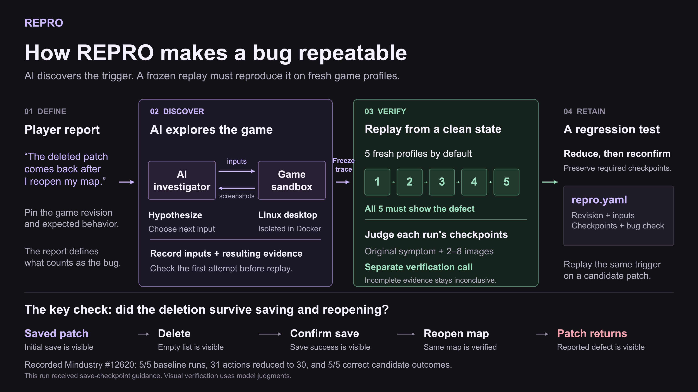

# REPRO reproduction method figure

- [PNG](repro-reproduction.png): 3200 × 1800, with the REPRO dark background. Drop this into a slide as a single image.
- [Editable PowerPoint](repro-reproduction-editable.pptx): one 16:9 slide with native text and vector objects. Source references and an explanation of the mechanism are in the speaker notes.
- [SVG](repro-reproduction.svg): a scalable, editable vector version.
- [Transparent PNG](repro-reproduction-transparent.png) and [transparent SVG](repro-reproduction-transparent.svg): for placing the figure over another **dark background**. Labels retain their light REPRO colors.

Suggested caption:

> REPRO records an AI-discovered input sequence, verifies the reported state transition across fresh game profiles, and reduces the sequence into a replayable regression.

Suggested explanation while presenting:

> The AI explores the game until it finds a candidate trigger. REPRO records the inputs and checks the initial evidence, then freezes the sequence. Each replay starts from a fresh profile. A separate verification call checks the original symptom using ordered screenshots, including the prerequisites and the effect of the action. Only consistently reproduced sequences advance. Reduction preserves required checkpoints and reconfirms shorter traces. The resulting replay becomes a regression test for the proposed patch.

## What the figure represents

This describes the live investigation implementation, specifically its **temporal visual verification** path. The hosted Report demo plays saved evidence and does not perform a new investigation. Crash and literal-log oracles use process state or log signatures instead of this image-sequence check.

Five runs is the default configuration, not a guarantee of universal determinism. The verifier is a separate call to the model, not a separate human or independently trained model. It receives raw evidence and the report-defined symptom without the investigator's conclusion. Missing, low-confidence or contradictory evidence is inconclusive. Reduction is bounded and does not establish the globally shortest possible trigger.

The bottom sequence is a schematic of the recorded Mindustry data-patch case, not a screenshot sequence or the complete action list. The numbers refer to `md-12620-terra-overnight-02`: 5/5 baseline confirmations, 31 actions reduced to 30, and 5/5 correct candidate outcomes. This run received guidance to record both save confirmations. Its report-only predecessor reached 3/5. The [case presentation evidence](../../demos/datapatch-2026-09-15/README.md) preserves that distinction.

## Implementation sources

Inspected at repository revision `1aa7839`:

- [Investigation and reduction](../../../repro/orchestration/manager.py): adaptive input selection, initial verification, repeated confirmation, checkpoint-preserving reduction and retained regression.
- [Replay](../../../repro/computer/replay.py) and [sandbox reset](../../../repro/computer/sandbox.py): fresh worker/profile, restored registered fixtures and unchanged recorded inputs.
- [Verifier](../../../repro/agents/oracle.py): original symptom, chronological checkpoint images, raw input trace and inconclusive judgments.
- [Models](../../../repro/models.py) and [settings](../../../repro/config.py): replay schema, 2–8 distinct sequence checkpoints and five repetitions by default.
- [Architecture](../../architecture.md): execution boundaries and the distinction between recorded model judgments and deterministic ground truth.

## Regeneration

`build-figure.mjs` defines one scene for both the SVG and native PowerPoint objects. The dark PNG renders from the finalized PowerPoint, and the transparent PNG renders from the SVG to preserve its alpha channel. It uses the Codex bundled `@oai/artifact-tool` and Sharp runtimes and the presentation finalizer, with Arial as the declared design font. It does not run a game or call an AI model.

Use the paths returned by `load_workspace_dependencies` for `RUNTIME_NODE_MODULES`, `RUNTIME_PYTHON` and the Node executable. Set `PRESENTATION_SKILL_DIR` to the installed presentation skill directory. Run the builder from the repository root. A subsequent revision needs new `REPRO_FIGURE_OUTPUT` and `REPRO_FIGURE_BUILD` directories because the finalizer deliberately refuses to overwrite a previously finalized PowerPoint. The validated files can then replace these figure assets after visual review.

The editable file contains one slide with native text and vector objects, with no embedded screenshot replacing the diagram. Its package, geometry and font-policy checks passed, and the rendered slide was inspected. This does not claim a native PowerPoint application test.
